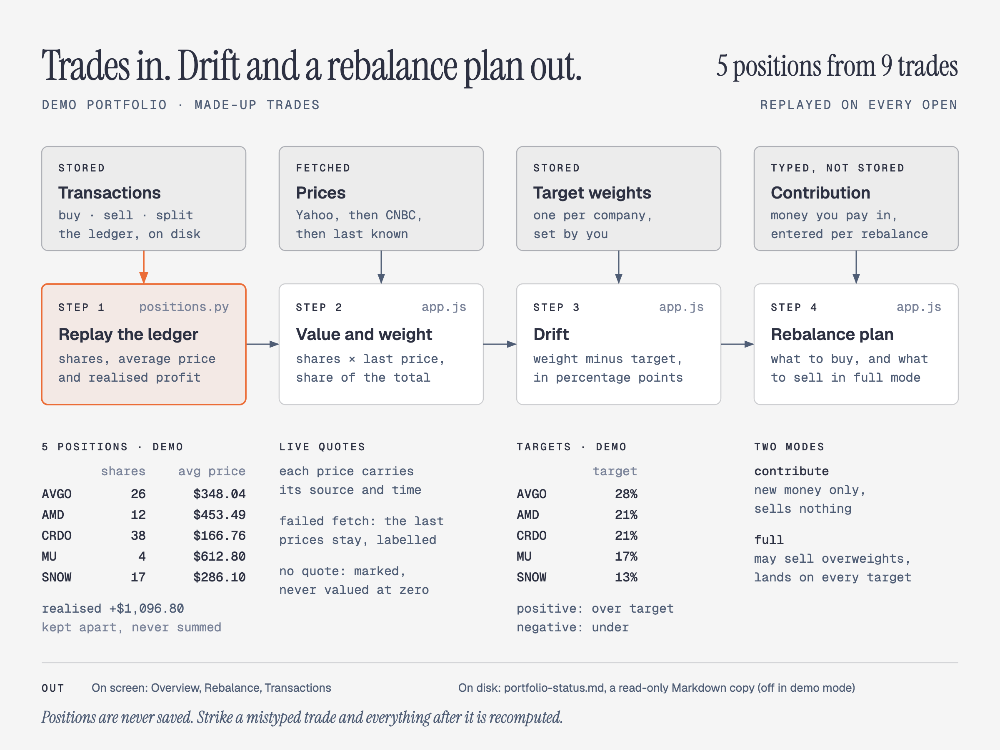
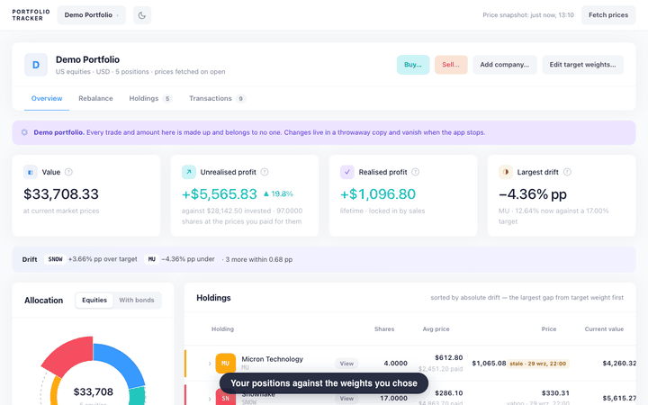
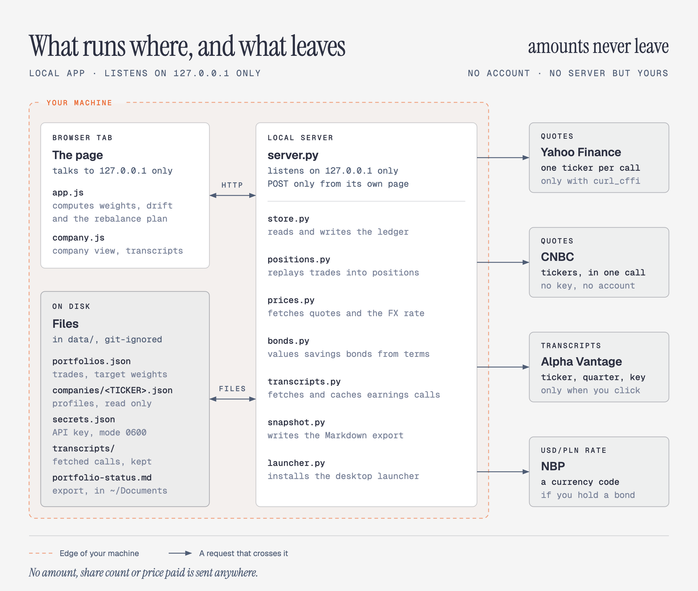

# Investment Portfolio

A local portfolio app for people who already track positions at a broker and need three things the broker does badly:

- **Rebalance against target weights.** Set the weight you want for each company; the app shows the drift and a plan to close it.
- **A clean ledger** that matches the statement line for line, so the same numbers can sit next to your company research notes.
- **A company view** that puts what you hold next to why you hold it: a thesis, charts and earnings-call transcripts, one company at a time.

<picture>
  <source media="(prefers-color-scheme: dark)" srcset="docs/diagrams/pipeline-dark.png">
  
</picture>



The same walkthrough as a [full-resolution video](docs/demo.mp4). Everything in it, and every figure in the diagrams on this page, is the [demo portfolio](#try-the-demo): made-up trades, real prices.

It runs on your machine, on the Python standard library alone: no `pip install`, no build step, no npm, no account, no server but yours.

```bash
python3 app/server.py   # Windows: python app/server.py
```

Opens [http://127.0.0.1:8777/](http://127.0.0.1:8777/). What leaves the machine: ticker symbols, to ask what they cost; a ticker, a quarter and your Alpha Vantage API key, only when you click for an earnings-call transcript; and a currency code to NBP if you hold a savings bond. No amount is ever sent. [How it works](#how-it-works) draws every request.

## What the app does

- **Overview.** Shares, average price, last price, value and profit against that average, plus weight and drift against your targets. Click a company to see its transactions with the average price building up after each one.
- **Rebalance.** A target weight per company and a plan to reach it: contribute-only, which never sells, or full.
- **Holdings.** One row per company. The only thing you type is the target weight.
- **Transactions.** The ledger, newest first, with what each sale realised. Strike a row and everything after it is recomputed.
- **Company.** Opens from a holding: the position, its company profile if it has one, and earnings-call transcripts (see [Status](#status)).

Realised and unrealised profit are shown apart and never summed: one is settled, the other moves with every quote. Commission is recorded but kept out of the average price, so it matches your broker's statement line for line; [`CONTEXT.md`](CONTEXT.md) explains why. Prices come from Yahoo, then CNBC, then the last known price, each labelled with its source and time.

## Why this exists

Broker apps are fine at "what do I hold?". They are awkward at "how far am I from the weights I chose?" and useless at "what do I believe about this company?". This project is the join between those: the ledger and the rebalance plan live in this app, the thesis and filings live in your notes, and the company view shows a profile from those notes next to the position.

It is not a research terminal and does no research. The analysis of a single name is written elsewhere and the app displays the result, which keeps the price fetcher and the ledger free of opinions.

## How it works

**Transactions are the only thing stored.** Share counts, average prices and realised profit are replayed from the ledger every time the app opens, so striking a mistyped trade recomputes everything after it, and a trade backdated into the middle of the history lands in the right place.

The page talks only to the server on your machine, and the server keeps everything in plain files. Four kinds of request cross the edge of the machine, and none of them carries an amount:

<picture>
  <source media="(prefers-color-scheme: dark)" srcset="docs/diagrams/machine-boundary-dark.png">
  
</picture>

## Status

Version 1, in use on a real portfolio. It works today: the ledger (buys, sells, splits), positions replayed from it, live quotes with a fallback chain, drift against target weights, contribute-only and full rebalance plans, XTB statement import, a company view, a read-only Markdown status export meant to sit in your notes (see [`how-to-use.md`](how-to-use.md)), and a double-click launcher on macOS, Windows and Linux.

The company view opens with *View* on any holding (*Profile* when the company has one):

- **Position.** Price, weight against target, drift and profit for that one company.
- **Company profile**, when a company has one. Thesis, the assumption hidden in management's guidance, revenue, segment, margin and debt charts, a scorecard, the conditions that would break the thesis, risks, and the earnings call in short. It is a JSON file, `companies/<TICKER>.json` in the data folder, and the app only displays it. The demo ships one for AVGO.
- **Earnings-call transcripts** for any ticker, split by speaker and searchable. They are fetched only when you click, from [Alpha Vantage](https://www.alphavantage.co/support/#api-key) with a free key, and kept on your machine. The key sits in `secrets.json`, readable only by you, and is never sent back to the page.

What it does not do: no AI inside the app, and no advice. It never says what to buy.

## Try the demo

A made-up portfolio of five AI-hardware and data companies, with a company profile for Broadcom:

```bash
python3 app/server.py --demo
```

Opens [http://127.0.0.1:8778/](http://127.0.0.1:8778/) on its own port, on a temporary copy of [`demo/`](demo/) that is deleted when the app stops, so nothing you record in it touches the repository or your real portfolio. It writes no status export. Only an Alpha Vantage key and fetched transcripts outlive it.

## Getting started

Start the server from the repository root (`python3 app/server.py`, or `python app/server.py` on Windows), then:

1. **Holdings → + Add company** to add a ticker and its target weight.
2. **Buy…** / **Sell…** to record trades, or **Transactions → Record transaction…** for an old trade or a split.
3. Optional: **View** on a holding, then paste a free Alpha Vantage key to fetch earnings-call transcripts. To give a company a profile, put `companies/<TICKER>.json` in the data folder; copy [`demo/companies/AVGO.json`](demo/companies/AVGO.json) for the shape.

Already have an account statement from XTB? `python3 scripts/import-xtb.py statement.xlsx` shows what it would import without writing anything; add `--into "Main Portfolio"` to commit it (`python` on Windows).

The first start also installs a double-clickable launcher for this checkout: `~/Applications/Portfolio.app` on macOS, `Portfolio.bat` in the Start Menu and on the Desktop on Windows, `~/.local/share/applications/portfolio.desktop` on Linux. `PORTFOLIO_NO_APP_INSTALL=1` skips it, set the same way as `PORTFOLIO_DATA_DIR` below. The server shuts itself down 30 minutes after you close the last tab, so nothing runs at login or overnight. [`how-to-use.md`](how-to-use.md) covers rebuilding the launcher and the rest of day-to-day use.

## Where your data lives

`data/portfolios.json`, next to the code, in plain JSON you can read, copy and edit by hand: the transaction ledger plus each portfolio's target weights. Company profiles go in `data/companies/`. The only thing keeping the file out of commits is `.gitignore`, and deleting this directory deletes your data with it, so keep a copy somewhere else if it matters to you.

Put it somewhere else with `PORTFOLIO_DATA_DIR`: `PORTFOLIO_DATA_DIR=/some/path python3 app/server.py` on macOS and Linux, `set PORTFOLIO_DATA_DIR=C:\some\path` before `python app/server.py` on Windows cmd, `$env:PORTFOLIO_DATA_DIR = "C:\some\path"` in PowerShell. Your Alpha Vantage key (`secrets.json`) and fetched transcripts (`transcripts/`) sit in the data folder too; `PORTFOLIO_LOCAL_DIR` moves just those two, and `--demo` leaves it pointed at your normal folder so they survive the throwaway demo copy.

## Requirements

Python 3.9+ on macOS, Linux or Windows. The Yahoo price source is optional (without it the app runs on CNBC alone): `pip3 install curl_cffi` (`pip` on Windows).

## Documentation

- [`app/README.md`](app/README.md): how the app is built and why
- [`how-to-use.md`](how-to-use.md): day-to-day cheat sheet
- [`CONTEXT.md`](CONTEXT.md): domain glossary
- [`research/price-source.md`](research/price-source.md): why the price sources are ordered the way they are

## Disclaimer

A personal project, shared for information only. It is not financial or investment advice: the rebalance plan is arithmetic on the weights you chose, not a recommendation. Prices come from public third-party sources and can be wrong or delayed, so check the figures against your broker's statement. No warranty (see [LICENSE](LICENSE)); use at your own risk.

## Licence

GPL v3. See [LICENSE](LICENSE).